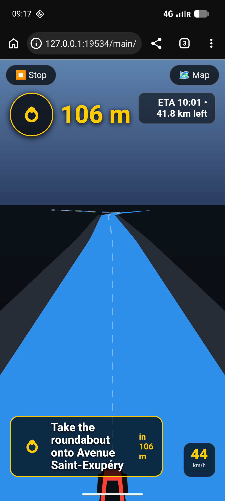

# GPS-Nav-HTML

A single-file, offline-first **GPS navigation app** built entirely with HTML, CSS and JavaScript. No app store, no account, no tracking — just open `gps6.html` in any modern mobile browser (both from Mobile phone or computer laptop) and start navigating.

# Try it !

Just open [(https://adegard.github.io/GPS-Nav-HTML/gps6.html)](https://adegard.github.io/GPS-Nav-HTML/gps6.html)

## Features

- **Live GPS tracking** — auto-starts on load, shows your position and heading on an OpenStreetMap map
- **Search & POIs** — search cities, streets and places (Photon geocoder), or tap the 🏪 button to browse nearby POIs (restaurants, fuel, parking, hotels, pharmacies, ATMs, sights…) fetched from Overpass/OpenStreetMap
- **Turn-by-turn navigation** — set a destination, get a full route with:
  - 🚗 **Car** or 🚶 **Walking** routing (OSRM + automatic Valhalla fallback when the OSRM servers are offline)
  - Route preference: ⭐ Best, ⚡ Fastest, 📏 Shortest
  - Automatic **rerouting** if you leave the route
- **Full-screen 3D driving view - Driving Assistance** — pseudo-3D perspective road view with junctions, side roads and a turning arrow, ETA, speed-to-turn assistance (car turn red if current speed is above max speed depending on turn angle) and max-speed warning signals. 
- **Voice guidance** — spoken instructions at key distances:
  - 🔊 System voice (device TTS)
  - 📡 Online voice (Google Translate TTS — works even on de-Googled devices where system TTS is silent)
  - 🔇 Muted
- **Slide-down menu** — all extra controls tuck into a compact ☰ menu so the map stays clear in portrait mode
- **Persistent settings** — your voice mode, transport mode and route preference are remembered between sessions
- **Wake lock** — keeps the screen on while navigating

## Screenshots

| 3D navigation view |
|---  |

## How to use

1. Download `gps6.html` (or clone this repo) onto your phone.
2. Open it in a browser — GPS starts automatically and the map centres on you.
3. **Search or tap the map** to set a destination.
4. Tap **🧭 Navigate** to get a route.
5. Use the **☰** menu to switch transport mode, voice, route preference or the 3D view.
6. Tap **⏹ Stop** to end navigation.

> Note: navigation needs an internet connection for map tiles, routing and POI search. Your GPS position itself never leaves the device.

## Data & services

- Map tiles & routing: [OpenStreetMap](https://www.openstreetmap.org) / [OSRM](https://project-osrm.org) / [Valhalla](https://valhalla.openstreetmap.de)
- Geocoding: [Photon](https://photon.komoot.io)
- Points of interest: [Overpass API](https://overpass-api.de) (OpenStreetMap data)

## License

OpenStreetMap data is © OpenStreetMap contributors (ODbL). The app itself is free to use and modify.
